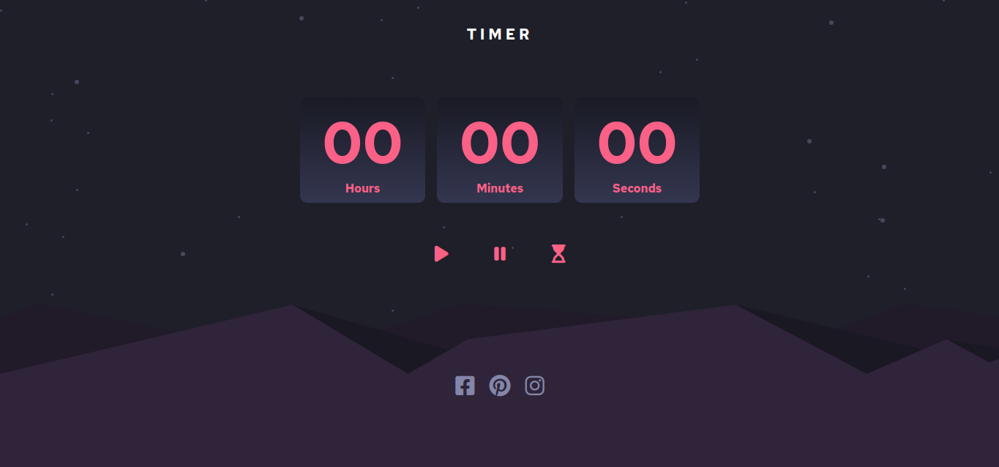

## Overview

### The challenge

Users should be able to:

- See hover states for all interactive elements on the page
- Start, pause and restart the timer

### Screenshot

### Links

- Live Site URL: [Live site URL](https://massensini-timer.netlify.app/)

### Built with

- Semantic HTML5 markup
- CSS custom properties
- Flexbox
- JavaScript
- setInterval()
- clearInterval()